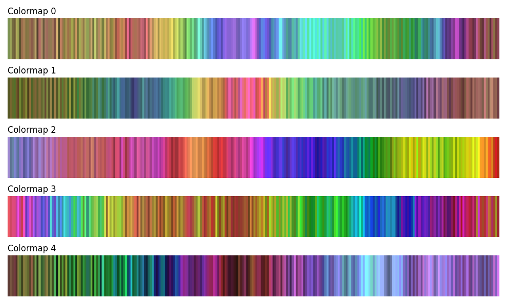
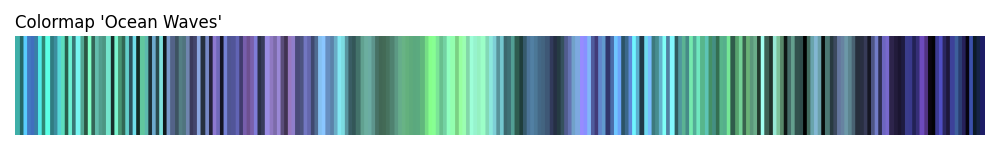
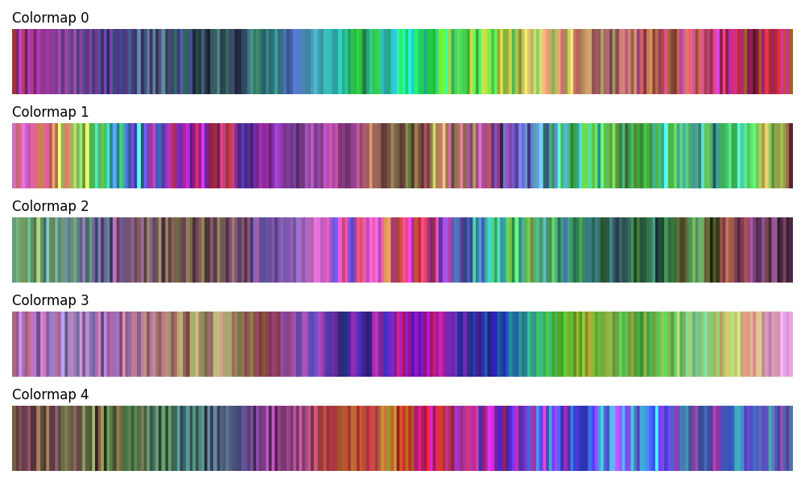

# ColorStripes

Generate beautiful, randomized colormaps with smooth transitions and stripe patterns for use with matplotlib and other visualization tools.



## Features

- 🎨 Generate unique colormaps with smooth background transitions
- 🌊 Add fine-scale "stripe" patterns with varying widths and intensities
- 🔧 Full matplotlib compatibility
- 💾 Export as JSON or PNG
- 🎲 Reproducible with seed values
- 🖼️ Generate preview swatches
- 🚀 Simple CLI interface

## Installation

### From Source (Development)

```bash
git clone https://github.com/yourusername/colorstripes.git
cd colorstripes
pip install -e .
```

### For Development

```bash
pip install -e ".[dev]"
```

## Quick Start

### Command Line Usage

Generate a random colormap:
```bash
colorstripes
```

Generate with specific parameters:
```bash
# Set a seed for reproducibility
colorstripes --seed 42 --name my_colormap

# Adjust stripe frequency
colorstripes --stripe-frequency 80

# Save the colormap
colorstripes --output my_colormap --format both
```

Available options:
- `--name, -n`: Name for the colormap (default: 'custom')
- `--seed, -s`: Random seed for reproducibility
- `--output, -o`: Output file path (without extension)
- `--format, -f`: Output format: 'png', 'json', or 'both' (default: 'both')
- `--n-points`: Number of points in colormap (default: 256)
- `--stripe-frequency`: Base frequency of stripes
- `--show/--no-show`: Display the generated colormap (default: show)

### Python API Usage

```python
from colorstripes import ColormapGenerator
import matplotlib.pyplot as plt

# Create generator
generator = ColormapGenerator(n_points=256, seed=42)

# Generate a colormap with custom parameters
cmap = generator.generate_colormap(
    name="my_custom_map",
    hue_range=(0.0, 0.3),  # Red to yellow range
    saturation_range=(0.5, 0.9),
    value_range=(0.4, 0.8),
    stripe_frequency=60,
    hue_stripe_amplitude=(0.02, 0.08)
)

# Use with matplotlib
import numpy as np
data = np.random.randn(100, 100)
plt.imshow(data, cmap=cmap)
plt.colorbar()
plt.show()

# Create a swatch preview
swatch = generator.create_swatch(cmap, width=800, height=60)
plt.imshow(swatch, aspect='auto')
plt.axis('off')
plt.show()
```

## Output Formats

### JSON Format
The JSON output contains RGB values for use in other applications:
```json
{
    "name": "custom",
    "colors": [[r, g, b], ...],
    "n_colors": 256
}
```

### PNG Format
- `{output}.png`: A gradient image of the colormap
- `{output}_swatch.png`: A preview swatch similar to the examples

## Advanced Usage

### Custom Parameter Ranges

```python
from colorstripes import ColormapGenerator

generator = ColormapGenerator()

# Generate with specific color characteristics
cmap = generator.generate_colormap(
    name="ocean_waves",
    hue_range=(0.5, 0.6),        # Blue-cyan range
    saturation_range=(0.3, 0.8),  # Varied saturation
    value_range=(0.3, 0.9),       # Dark to light
    n_control_points=7,           # More control points for complexity
    stripe_frequency=45,          # Wider stripes
    frequency_variation=0.7,      # More variation in stripe width
    hue_stripe_amplitude=(0.01, 0.04),  # Subtle hue variations
    val_stripe_amplitude=(0.1, 0.25)    # Stronger brightness stripes
)
```

The script `examples/custom_params.py` utilises this approach and generates the following image:



### Batch Generation

```python
from colorstripes import ColormapGenerator
import matplotlib.pyplot as plt

generator = ColormapGenerator()

# Generate multiple colormaps
fig, axes = plt.subplots(5, 1, figsize=(10, 6))

for idx in range(5):
    cmap = generator.generate_colormap(name=f"colormap_{idx}")
    swatch = generator.create_swatch(cmap)
    axes[idx].imshow(swatch, aspect='auto')
    axes[idx].axis('off')
    axes[idx].set_title(f"Colormap {idx}", loc='left')

plt.tight_layout()
plt.show()
```

The script `examples/batch_generation.py` utilises this approach and generates output similar to the following:



## Mathematical Approach

ColorStripes uses several mathematical techniques to create complex, visually appealing colormaps:

1. **Smooth Base Colors**: Spline interpolation in HSV color space with control points
2. **Rate Variation**: Sine wave modulation for varying transition speeds
3. **Stripe Generation**: Multiple frequency components with:
   - Frequency modulation for varying stripe widths
   - Amplitude modulation across the colormap
   - Optional waveform shaping (tanh) for sharper edges
4. **Color Space Manipulation**: Works in HSV for intuitive control, converts to RGB for output

## Testing

Run the test suite:
```bash
pytest
```

With coverage:
```bash
pytest --cov=colorstripes
```

## Contributing

Contributions are welcome! Please feel free to submit a Pull Request.

## License

This project is licensed under the MIT License - see the LICENSE file for details.